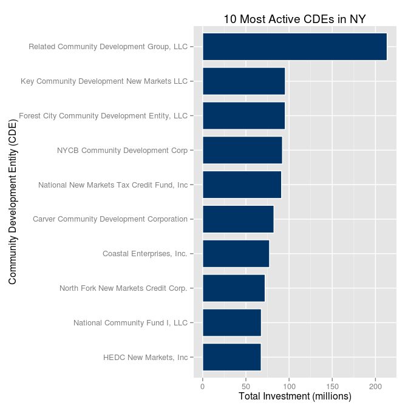

# Analysis of the New Markets Tax Credit Program
Rashan Jibowu  
03/20/2015  

Load necessary libraries


```r
library(data.table)
library(ggplot2)
```

Load the data


```r
data <- read.csv("./data/projects.csv", na.strings = NA)
```

Clean up column names


```r
colnames(data) <- c("projectID", "metroStatus", "year", "CDE", "investment", "projectCost", "city", "state", "zipcode", "purpose", "investeeType", "multiCDEStatus", "multiTractStatus")
```

Clean up California data


```r
data[data$state == "Ca",]["state"] <- c("CA")
```

Convert to data table for faster processing


```r
dt <- data.table(data)
```

Add columns for analysis


```r
# portion financed
dt <- dt[, portionFinanced:=investment/projectCost]

# consolidate purpose categories
dt <- dt[, purposeCategory:=purpose]

indicies <- grep("Business Financing|Microenterprise", dt$purpose)
dt[indicies, "purposeCategory"] <- c("Business")

indicies <- grep("Multi Family", dt$purpose)
dt[indicies, "purposeCategory"] <- c("Real Estate -- Multi-Family")

indicies <- grep("Single Family", dt$purpose)
dt[indicies, "purposeCategory"] <- c("Real Estate -- Single-Family")

indicies <- grep("Commercial", dt$purpose)
dt[indicies, "purposeCategory"] <- c("Real Estate -- Commercial")

indicies <- grep("Other", dt$purpose)
dt[indicies, "purposeCategory"] <- c("Other")

# convert to a factor
dt$purposeCategory <- as.factor(dt$purposeCategory)
```

Find and plot the ten most active CDFIs overall


```r
totalInvestedByCDE <- dt[,list(totalInvestment = sum(investment)), by = c("CDE")]
```

```
## Warning in gsum(investment): Group 3 summed to more than type 'integer'
## can hold so the result has been coerced to 'numeric' automatically, for
## convenience.
```

```r
# Exclude the Multi-CDE Projects
topInvestors <- totalInvestedByCDE[order(totalInvestment, decreasing = TRUE),][2:11]

# prepare plot parameters
title <- c("10 Most Active CDEs")
yLabel <- c("Total Investment (millions)")
xLabel <- c("Community Development Entity (CDE)")

# Plot data
g <- ggplot(topInvestors, aes(y = totalInvestment / 1e+06, x = CDE))
g + geom_bar(stat = "identity", color = "white", fill = "#003366", width = 0.8) + 
  #scale_x_discrete(limits = rev(levels("CDE"))) + 
  coord_flip() + 
  labs(title = title, x = xLabel, y = yLabel)
```

 

Find and plot the most active CDFIs in NY


```r
# Filter for projects in NY only and exclude multi-CDE projects
nyInvestors <- dt[(state == "NY" & CDE != "Multi-CDE Project"), list(totalInvestment = sum(investment)), by = c("CDE")]

# prepare plot parameters
title <- c("10 Most Active CDEs in NY")
yLabel <- c("Total Investment (millions)")
xLabel <- c("Community Development Entity (CDE)")

# plot data
g <- ggplot(nyInvestors, aes(y = totalInvestment / 1e+06, x = CDE))
g + geom_bar(stat = "identity", color = "white", fill = "#003366", width = 0.8) + 
  coord_flip() + 
  labs(title = title, x = xLabel, y = yLabel)
```

 

Find and plot average capital deployed per state


```r
title <- c("Average Invested in Each State")
yLabel <- c("Average Invested (millions)")
xLabel <- c("State")

avgPerState <- dt[,list(avgInvested = mean(investment, na.rm = TRUE)), by = c("state")]

g <- ggplot(avgPerState, aes(x = avgInvested / 1e+06, y = state))
g + geom_point() + labs(title = title, y = xLabel, x = yLabel)
```

 

Find average portion of projects financed with NMTC dollars


```r
# average portion funded by state
dt[CDE != "Multi-CDE Project", list(avgPortionFinanced = mean(portionFinanced, na.rm = TRUE)), by = c("state")]
```

```
##     state avgPortionFinanced
##  1:    AK          0.7741083
##  2:    AL          0.6498661
##  3:    AR          0.7447590
##  4:    AZ          0.6762752
##  5:    CA          0.6711710
##  6:    OR          0.7285715
##  7:    MO          0.7377126
##  8:    CO          0.5769954
##  9:    CT          0.5313686
## 10:    DC          0.5962674
## 11:    DE          0.5718474
## 12:    FL          0.7151591
## 13:    GA          0.7395792
## 14:    MI          0.6901640
## 15:    HI          0.7493190
## 16:    IA          0.7695285
## 17:    ID          0.7557281
## 18:    IL          0.7163122
## 19:    IN          0.8497260
## 20:    KS          0.6704718
## 21:    KY          0.8512035
## 22:    LA          0.8037562
## 23:    MA          0.7729559
## 24:    MD          0.6753684
## 25:    ME          0.7493029
## 26:    NJ          0.6734355
## 27:    MN          0.6883381
## 28:    MS          0.7976924
## 29:    MT          0.8929470
## 30:    NC          0.6252611
## 31:    ND          0.7696307
## 32:    NE          0.5396387
## 33:    NH          0.6573557
## 34:    SC          0.6923587
## 35:    NY          0.6844477
## 36:    NM          0.5868434
## 37:    NV          0.6776512
## 38:    OH          0.7517621
## 39:    OK          0.8011458
## 40:    PA          0.7108533
## 41:    TX          0.7068748
## 42:    PR          0.5403873
## 43:    RI          0.6214800
## 44:    SD          0.7096686
## 45:    TN          0.7944558
## 46:    UT          0.7165560
## 47:    VA          0.7367967
## 48:    WV          0.7562862
## 49:                0.9462652
## 50:    VT          0.8471183
## 51:    WA          0.6970885
## 52:    WI          0.6424956
## 53:    WY          0.5973331
##     state avgPortionFinanced
```

Find average portion financed over time


```r
# average funded over time
avgPortionByYear <- dt[CDE != "Multi-CDE Project", list(avgPortionFinanced = mean(portionFinanced, na.rm = TRUE)), by = c("year")]

 g <- ggplot(avgPortionByYear, aes(x = year, y = avgPortionFinanced))
 g + geom_line()
```

 

Find average portion of projects funded by purpose


```r
dt[,list(avgPortion = mean(portionFinanced, na.rm = TRUE)), by = c("purposeCategory")]
```

```
##                 purposeCategory avgPortion
## 1:                     Business  0.7422870
## 2:    Real Estate -- Commercial  0.6909290
## 3: Real Estate -- Single-Family  0.6395683
## 4:                        Other  0.8923109
## 5:  Real Estate -- Multi-Family  0.6534208
```
