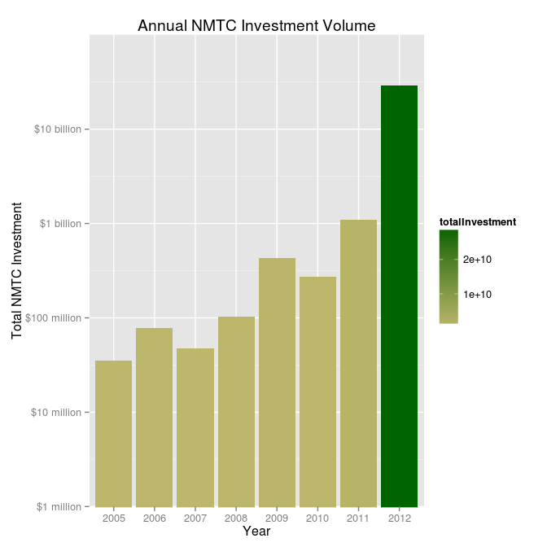
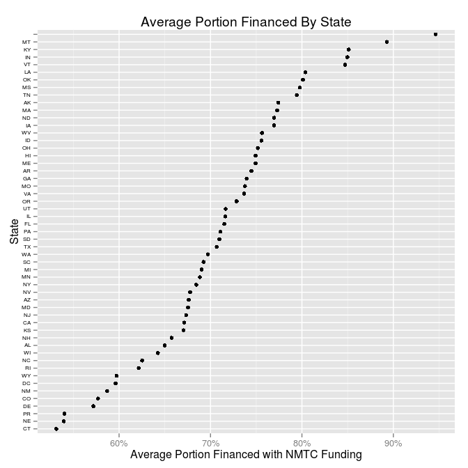
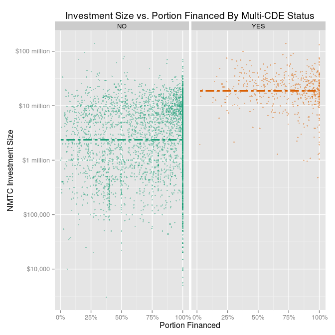
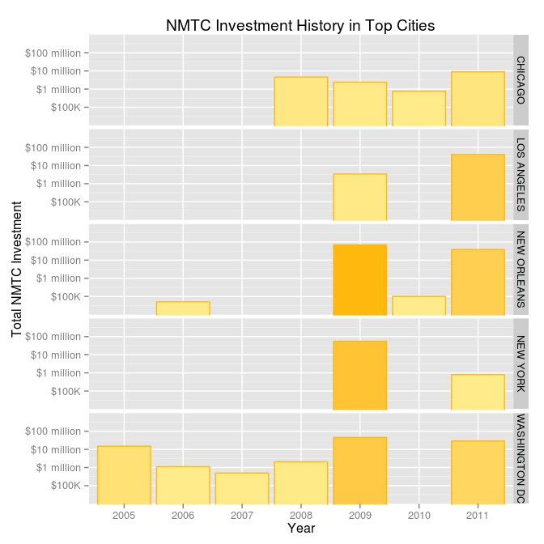

# Analysis of the New Markets Tax Credit Program
Rashan Jibowu  
03/24/2015  

Set global options


```r
knitr::opts_chunk$set(cache = FALSE, fig.width = 7, fig.height = 7, collapse = TRUE)
```

Load necessary libraries


```r

library(data.table)
library(ggplot2)
library(scales)
library(grid)
```

Load the NMTC project data


```r

data <- read.csv("./data/projects.csv", na.strings = NA)

downloadData <- c(FALSE)

# download historical data: 1996 - 2004
if (downloadData) {
  url <- c("http://www2.census.gov/acs/downloads/Core_Tables/1996/ACS_1996_G90_050_20050303_093024.csv")
  download.file(url, destfile = "./data/first1996.csv", method = "curl")
  old <- read.csv("./data/first1996.csv", na.strings = NA)
  head(old)
}
```

Zipcode data


```r

# download zip code data if it doesn't already exist
zipcode.path <- c("./data/zipcode.csv")

if (!file.exists(zipcode.path)) {
    zipcodeURL <- c("http://www.boutell.com/zipcodes/zipcode.zip")
    download.file(zipcodeURL, destfile = "./data/zipcode.zip", method = "curl")
    unzip("./data/zipcode.zip", exdir = "./data/")    
}

# read in zipcode data
zipcodeData <- read.csv(zipcode.path, colClasses = c("character"))
    
# clean zipcode data
zipcodeData$zip <- as.factor(zipcodeData$zip)
zipcodeData$city <- as.factor(zipcodeData$city)
zipcodeData$state <- as.factor(zipcodeData$state)
zipcodeData$latitude <- as.numeric(zipcodeData$latitude)
zipcodeData$longitude <- as.numeric(zipcodeData$longitude)
zipcodeData$timezone <- as.integer(zipcodeData$timezone)
zipcodeData$dst <- as.integer(zipcodeData$dst)  

# convert data frame to data.table for faster processing
zipcodes <- data.table(zipcodeData)

str(zipcodes)
## Classes 'data.table' and 'data.frame':	43191 obs. of  7 variables:
##  $ zip      : Factor w/ 43191 levels "00210","00211",..: 1 2 3 4 5 6 7 8 9 10 ...
##  $ city     : Factor w/ 19053 levels "Aaronsburg","Abbeville",..: 13674 13674 13674 13674 13674 13674 7642 7642 73 93 ...
##  $ state    : Factor w/ 54 levels "AK","AL","AR",..: 32 32 32 32 32 32 36 36 41 41 ...
##  $ latitude : num  43 43 43 43 43 ...
##  $ longitude: num  -71 -71 -71 -71 -71 ...
##  $ timezone : int  -5 -5 -5 -5 -5 -5 -5 -5 -4 -4 ...
##  $ dst      : int  1 1 1 1 1 1 1 1 0 0 ...
##  - attr(*, ".internal.selfref")=<externalptr>
```

Unemployment By Zipcode


```r

url <- c("https://s3.amazonaws.com/SplitwiseBlogJB/Unemployment+Unsorted.csv")
unemploymentByZipcode.path <- c("./data/unemploymentByZipcode.csv")

if (!file.exists(unemploymentByZipcode.path)) {
    download.file(url, destfile = unemploymentByZipcode.path, method = "curl")
}

uBZ <- read.csv(unemploymentByZipcode.path, colClasses = c("character"))

str(uBZ)
## 'data.frame':	33120 obs. of  3 variables:
##  $ Zip         : chr  "01001" "01002" "01003" "01005" ...
##  $ Unemp..Rate : chr  "6%" "9%" "17%" "10%" ...
##  $ X..in.sample: chr  "13801" "24551" "11477" "4086" ...
```

Translate zipcodes into county and census tract  
*Files are located at the **[Census website](https://www.census.gov/geo/maps-data/data/zcta_rel_download.html)***


```r

dataDir <- c("./data/")

zip2census.path <- paste0(dataDir, c("zip2census.txt"))
zip2county.path <- paste0(dataDir, c("zip2county.txt"))

# convert to county
if (!file.exists(zip2county.path)) {
    zip2countyURL <- c("http://www2.census.gov/geo/docs/maps-data/data/rel/zcta_county_rel_10.txt")
    download.file(zip2countyURL, destfile = zip2county.path, method = "curl")
}

zip2county <- data.table(read.csv(zip2county.path))

# convert to census tract
if (!file.exists(zip2census.path)) {    
    zip2censusURL <- c("http://www2.census.gov/geo/docs/maps-data/data/rel/zcta_tract_rel_10.txt")
    download.file(zip2censusURL, destfile = zip2census.path, method = "curl")    
}

zip2census <- data.table(read.csv(zip2census.path))

str(zip2county)
## Classes 'data.table' and 'data.frame':	44410 obs. of  24 variables:
##  $ ZCTA5        : int  601 601 602 603 606 606 606 610 610 612 ...
##  $ STATE        : int  72 72 72 72 72 72 72 72 72 72 ...
##  $ COUNTY       : int  1 141 3 5 93 121 153 3 11 13 ...
##  $ GEOID        : int  72001 72141 72003 72005 72093 72121 72153 72003 72011 72013 ...
##  $ POPPT        : int  18465 105 41520 54689 6276 89 250 160 28856 66938 ...
##  $ HUPT         : int  7695 49 18073 25653 2740 38 99 62 12556 30961 ...
##  $ AREAPT       : num  1.65e+08 2.33e+06 8.37e+07 8.21e+07 9.49e+07 ...
##  $ AREALANDPT   : num  1.64e+08 2.33e+06 7.93e+07 8.19e+07 9.49e+07 ...
##  $ ZPOP         : int  18570 18570 41520 54689 6615 6615 6615 29016 29016 67010 ...
##  $ ZHU          : int  7744 7744 18073 25653 2877 2877 2877 12618 12618 30992 ...
##  $ ZAREA        : num  1.67e+08 1.67e+08 8.37e+07 8.21e+07 1.10e+08 ...
##  $ ZAREALAND    : num  1.67e+08 1.67e+08 7.93e+07 8.19e+07 1.10e+08 ...
##  $ COPOP        : int  19483 33149 41959 60949 6276 25265 42043 41959 29261 96440 ...
##  $ COHU         : int  8125 14192 18258 28430 2740 10958 18020 18258 12755 43253 ...
##  $ COAREA       : num  1.74e+08 2.98e+08 1.18e+08 1.96e+08 9.49e+07 ...
##  $ COAREALAND   : num  1.73e+08 2.94e+08 7.99e+07 9.46e+07 9.49e+07 ...
##  $ ZPOPPCT      : num  99.43 0.57 100 100 94.88 ...
##  $ ZHUPCT       : num  99.37 0.63 100 100 95.24 ...
##  $ ZAREAPCT     : num  98.61 1.39 100 100 86.56 ...
##  $ ZAREALANDPCT : num  98.6 1.4 100 100 86.6 ...
##  $ COPOPPCT     : num  94.77 0.32 98.95 89.73 100 ...
##  $ COHUPCT      : num  94.71 0.35 98.99 90.23 100 ...
##  $ COAREAPCT    : num  95.03 0.78 70.99 41.92 100 ...
##  $ COAREALANDPCT: num  95.14 0.79 99.23 86.55 100 ...
##  - attr(*, ".internal.selfref")=<externalptr>
str(zip2census)
## Classes 'data.table' and 'data.frame':	148897 obs. of  25 variables:
##  $ ZCTA5        : int  601 601 601 601 601 601 601 602 602 602 ...
##  $ STATE        : int  72 72 72 72 72 72 72 72 72 72 ...
##  $ COUNTY       : int  1 1 1 1 1 1 141 3 3 3 ...
##  $ TRACT        : int  956300 956400 956500 956600 956700 956800 957600 430100 430200 430300 ...
##  $ GEOID        : num  7.2e+10 7.2e+10 7.2e+10 7.2e+10 7.2e+10 ...
##  $ POPPT        : int  4271 2384 3126 2329 2053 4302 105 4983 5388 2646 ...
##  $ HUPT         : int  1706 1037 1240 972 948 1792 49 2099 2522 1374 ...
##  $ AREAPT       : num  44663250 32830481 44969548 1981101 1380041 ...
##  $ AREALANDPT   : num  44572589 32492074 44809680 1981101 1380041 ...
##  $ ZPOP         : int  18570 18570 18570 18570 18570 18570 18570 41520 41520 41520 ...
##  $ ZHU          : int  7744 7744 7744 7744 7744 7744 7744 18073 18073 18073 ...
##  $ ZAREA        : num  1.67e+08 1.67e+08 1.67e+08 1.67e+08 1.67e+08 ...
##  $ ZAREALAND    : num  1.67e+08 1.67e+08 1.67e+08 1.67e+08 1.67e+08 ...
##  $ TRPOP        : int  4336 2995 3126 2329 2053 4644 3858 4983 5388 2646 ...
##  $ TRHU         : int  1735 1294 1240 972 948 1936 1634 2099 2522 1374 ...
##  $ TRAREA       : num  44924558 37782601 44969548 1981101 1380041 ...
##  $ TRAREALAND   : num  44833897 37191697 44809680 1981101 1380041 ...
##  $ ZPOPPCT      : num  23 12.8 16.8 12.5 11.1 ...
##  $ ZHUPCT       : num  22 13.4 16 12.6 12.2 ...
##  $ ZAREAPCT     : num  26.67 19.61 26.85 1.18 0.82 ...
##  $ ZAREALANDPCT : num  26.74 19.5 26.89 1.19 0.83 ...
##  $ TRPOPPCT     : num  98.5 79.6 100 100 100 ...
##  $ TRHUPCT      : num  98.3 80.1 100 100 100 ...
##  $ TRAREAPCT    : num  99.4 86.9 100 100 100 ...
##  $ TRAREALANDPCT: num  99.4 87.4 100 100 100 ...
##  - attr(*, ".internal.selfref")=<externalptr>
```

Clean up column names


```r

colnames(data) <- c("projectID", "metroStatus", "year", "CDE", "investment", "projectCost", "city", "state", "zipcode", "purpose", "investeeType", "multiCDEStatus", "multiTractStatus")
```

Clean up California data


```r

data[data$state == "Ca",]["state"] <- c("CA")
```

Convert certain variables into factors


```r

data$investeeType <- as.factor(data$investeeType)
```

Convert investment variable to numeric format


```r

data$investment <- as.numeric(data$investment)
```

Clean up city names


```r

data$city <- tolower(data$city)

indices <- grep("chicago,", data$city)
data[indices, c("city")] <- c("chicago")

indices <- grep("cleveland|clveland,", data$city)
data[indices, c("city")] <- c("cleveland")

indices <- grep("couer dalene", data$city)
data[indices, c("city")] <- c("couer d'alene")

indices <- grep("detroit,|detriot", data$city)
data[indices, c("city")] <- c("detroit")

indices <- grep("ft.*myers", data$city)
data[indices, c("city")] <- c("fort myers")

indices <- grep("ft. worth", data$city)
data[indices, c("city")] <- c("fort worth")

indices <- grep("ft. lauderdale", data$city)
data[indices, c("city")] <- c("fort lauderdale")

indices <- grep("ft.*wayne", data$city)
data[indices, c("city")] <- c("fort wayne")

indices <- grep("gainsville", data$city)
data[indices, c("city")] <- c("gainesville")

indices <- grep("grand rapids", data$city)
data[indices, c("city")] <- c("grand rapids")

indices <- grep("hamtramck", data$city)
data[indices, c("city")] <- c("hamtrack")

indices <- grep("jacksonville", data$city)
data[indices, c("city")] <- c("jacksonville")

indices <- grep("lacross", data$city)
data[indices, c("city")] <- c("la crosse")

indices <- grep("lynwood", data$city)
data[indices, c("city")] <- c("lynnwood")

indices <- grep("mid west city", data$city)
data[indices, c("city")] <- c("midwest city")

indices <- grep("mt.*vernon", data$city)
data[indices, c("city")] <- c("mount vernon")

indices <- grep("opa-locka", data$city)
data[indices, c("city")] <- c("opa locka")

indices <- grep("philadephia", data$city)
data[indices, c("city")] <- c("philadelphia")

indices <- grep("pittsburg", data$city)
data[indices, c("city")] <- c("pittsburgh")

indices <- grep("poughkeepsie", data$city)
data[indices, c("city")] <- c("poughkeepsie")

indices <- grep("san bernardino", data$city)
data[indices, c("city")] <- c("san bernadino")

indices <- grep("san fracisco", data$city)
data[indices, c("city")] <- c("san francisco")

indices <- grep("sprinfield", data$city)
data[indices, c("city")] <- c("springfield")

indices <- grep("st.*louis", data$city)
data[indices, c("city")] <- c("st. louis")

indices <- grep("st.*paul|saint paul", data$city)
data[indices, c("city")] <- c("st. paul")

indices <- grep("st.*peter(s)?burg", data$city)
data[indices, c("city")] <- c("st. petersburg")

indices <- grep("washington", data$city)
data[indices, c("city")] <- c("washington dc")

indices <- grep("wilmington", data$city)
data[indices, c("city")] <- c("wilmington")

# merge boroughs of NY
indices <- grep("^(bronx|brooklyn)$", data$city)
data[indices, c("city")] <- c("new york")

data[(data$city == "manhattan" & data$state == "NY"), c("city")] <- c("new york")

# merge factors
data$city <- as.factor(data$city)
```

Convert to data table for faster processing


```r

dt <- data.table(data)
```

Update levels for recipient factor variable


```r

levels(dt$investeeType)[c(3:4)] <- c("Non-Real Estate", "Real Estate")
```

Add columns for analysis


```r

# portion financed
dt <- dt[, portionFinanced:=investment/projectCost]

# consolidate purpose categories
dt <- dt[, purposeCategory:=purpose]

indicies <- grep("Business Financing|Microenterprise", dt$purpose)
dt[indicies, "purposeCategory"] <- c("Business")

indicies <- grep("Multi Family", dt$purpose)
dt[indicies, "purposeCategory"] <- c("Multi-family")

indicies <- grep("Single Family", dt$purpose)
dt[indicies, "purposeCategory"] <- c("Single-family")

indicies <- grep("Commercial", dt$purpose)
dt[indicies, "purposeCategory"] <- c("Com. RE")

indicies <- grep("Other", dt$purpose)
dt[indicies, "purposeCategory"] <- c("Other")

# convert to a factor
dt$purposeCategory <- as.factor(dt$purposeCategory)
```

Annual Investment Volume


```r

# form the data
totalByYear <- dt[,
                  list(totalInvestment = sum(investment, na.rm = TRUE)), 
                  by = c("year")]

# Prepare plot parameters
title <- c("Annual NMTC Investment Volume")
yLabel <- c("Total NMTC Investment")
xLabel <- c("Year")
labels <- c("$1 million", "$10 million", "$100 million", "$1 billion", "$10 billion")

# make plot
g <- ggplot(totalByYear, aes(y = totalInvestment + 1, 
                             x = factor(year), 
                             fill = totalInvestment)) 

g + scale_fill_gradient(low = "darkkhaki", high = "darkgreen") +
    geom_bar(stat = "identity") +   
    scale_y_log10(breaks = c(1e+06, 1e+07, 1e+08, 1e+09, 1e+10),
                  labels = labels) + 
    labs(title = title, x = xLabel, y = yLabel) +
    coord_cartesian(ylim = c(1e+06, 1e+11)) 
```

 

Find and plot the ten most active CDFIs overall


```r

totalInvestedByCDE <- suppressWarnings(dt[, 
                                          list(totalInvestment = sum(investment)), 
                                          by = c("CDE")])

# Exclude the Multi-CDE Projects
topInvestors <- totalInvestedByCDE[order(totalInvestment, decreasing = TRUE),][2:11]

# prepare plot parameters
title <- c("10 Most Active CDEs")
yLabel <- c("Total Investment (millions)")
xLabel <- c("Community Development Entity (CDE)")

# Plot data
g <- ggplot(topInvestors, 
            aes(y = totalInvestment / 1e+06, x = reorder(CDE, totalInvestment)))

g + geom_bar(stat = "identity", color = "white", fill = "#003366", width = 0.8) + 
  coord_flip() + 
  labs(title = title, x = xLabel, y = yLabel)
```

 

Find and plot the most active CDFIs in NY


```r

# Filter for projects in NY only and exclude multi-CDE projects
nyInvestors <- dt[(state == "NY" & CDE != "Multi-CDE Project"), 
                  list(totalInvestment = sum(investment, na.rm = TRUE)), 
                  by = c("CDE")]

topNYInvestors <- nyInvestors[order(totalInvestment, decreasing = TRUE), ][1:10,]

# prepare plot parameters
title <- c("10 Most Active CDEs in NY")
yLabel <- c("Total Investment (millions)")
xLabel <- c("Community Development Entity (CDE)")

# plot data
g <- ggplot(topNYInvestors, 
            aes(y = totalInvestment / 1e+06, x = reorder(CDE, totalInvestment)))

g + geom_bar(stat = "identity", color = "white", fill = "#003366", width = 0.8) + 
  coord_flip() + 
  labs(title = title, x = xLabel, y = yLabel)
```

 

Find and plot average capital deployed per state


```r

title <- c("Average Invested Per Deal in Each State")
xLabel <- c("Average Invested Per Deal (millions)")
yLabel <- c("State")

avgPerState <- dt[, 
                  list(avgInvested = mean(investment, na.rm = TRUE)), 
                  by = c("state")]

g <- ggplot(avgPerState, 
            aes(x = avgInvested / 1e+06, y = reorder(state, avgInvested)))

g + geom_point() + 
  labs(title = title, y = yLabel, x = xLabel) +
  theme(axis.text.y = element_text(size = 6, color = "#000000"))
```

 

Find average portion of projects financed with NMTC dollars


```r

title <- c("Average Portion Financed By State")
xLabel <- c("Average Portion Financed with NMTC Funding")
yLabel <- c("State")

# average portion funded by state
avgPortionByState <- dt[CDE != "Multi-CDE Project", 
                        list(avgPortionFinanced = mean(portionFinanced, na.rm = TRUE)), 
                        by = c("state")]

g <- ggplot(avgPortionByState, aes(x = avgPortionFinanced, y = reorder(state, avgPortionFinanced)))

g + geom_point() +
  scale_x_continuous(labels = percent_format()) +
  labs(title = title, y = yLabel, x = xLabel) +
  theme(axis.text.y = element_text(size = 6, color = "#000000"))
```

 

Plot the average portion financed over time by purpose


```r

# Prepare plot parameters
title <- c("Average Portion Financed By Year and Purpose")
yLabel <- c("Average Portion Financed with NMTC Funding")
xLabel <- c("Year")

# average funded over time
avgPortionByYear <- dt[CDE != "Multi-CDE Project", 
                       list(avgPortionFinanced = mean(portionFinanced, na.rm = TRUE)),
                       by = c("year", "purposeCategory")]

# Make the plot
g <- ggplot(avgPortionByYear, aes(x = year, y = avgPortionFinanced))
g + geom_line() +
  facet_grid(purposeCategory~.) +
  scale_y_continuous(labels = percent_format()) +
  scale_x_continuous(breaks = unique(avgPortionByYear$year)) +
  labs(title = title, x = xLabel, y = yLabel) +
  theme(axis.text.y = element_text(size = 8, color = "#000000"),
        strip.text.y = element_text(size = 6.5),
        panel.margin = unit(0.5, "lines"))
```

 

Plot average portion financed over time by investeeType


```r

# Prepare plot parameters
title <- c("Average Portion Financed By Year and Recipient")
yLabel <- c("Average Portion Financed with NMTC Funding")
xLabel <- c("Year")

# average funded over time
avgPortionByYear <- dt[investeeType != "", 
                       list(avgPortionFinanced = mean(portionFinanced, na.rm = TRUE)),
                       by = c("year", "investeeType")]

# Make the plot
g <- ggplot(avgPortionByYear, aes(x = year, y = avgPortionFinanced))
g + geom_line() +
  facet_grid(investeeType~.) +
  scale_y_continuous(labels = percent_format()) +
  scale_x_continuous(breaks = unique(avgPortionByYear$year)) +
  labs(title = title, x = xLabel, y = yLabel) +
  theme(axis.text.y = element_text(size = 8, color = "#000000"),
        strip.text.y = element_text(size = 6.5),
        panel.margin = unit(0.5, "lines"))
```

 

Plot deal size against portion financed


```r

# Prepare plot parameters
title <- c("Investment Size vs. Portion Financed By Multi-CDE Status")
yLabel <- c("NMTC Investment Size")
xLabel <- c("Portion Financed")

# special labels for log transformation of y axis
yAxisLabels <- c("$1,000", "$10,000", "$100,000", "$1 million", "$10 million", "$100 million", "$1 billion")

# make plot
g <- ggplot(dt, 
            aes(x = portionFinanced, y = investment + 1, color = multiCDEStatus))

g + geom_point(alpha = 0.4, size = 1) +   
  scale_color_brewer(type = "qual", palette = 2, name = "Multi-CDE Project") +
  geom_line(stat = "hline", yintercept = "mean", linetype = "twodash", size = 1) +   
  labs(title = title, x = xLabel, y = yLabel) +
  scale_x_continuous(labels = percent_format()) +
  scale_y_log10(breaks = trans_breaks("log10", function(x) 10^x),
                labels = yAxisLabels)
```

 

Separate plot into facets for clarity


```r

# make plot
g <- ggplot(dt, 
            aes(x = portionFinanced, y = investment + 1, color = multiCDEStatus))

g + geom_point(alpha = 0.4, size = 1) +   
  scale_color_brewer(type = "qual", palette = 2, name = "Multi-CDE Project") +
  geom_line(stat = "hline", yintercept = "mean", linetype = "twodash", size = 1) +   
  labs(title = title, x = xLabel, y = yLabel) +
  scale_x_continuous(labels = percent_format()) +
  scale_y_log10(breaks = trans_breaks("log10", function(x) 10^x),
                labels = yAxisLabels) +
  facet_grid(.~multiCDEStatus) + 
  theme(legend.position = "none")
```

 

Cities with the greatest investment


```r

# form the data
investmentByCity <- dt[,
                       list(totalInvestment = sum(investment, na.rm = TRUE)), 
                       by = c("city", "state")]

topCities <- investmentByCity[order(totalInvestment, decreasing = TRUE),][1:10,]

# Prepare plot parameters
title <- c("Cities Most Invested In")
yLabel <- c("Total NMTC Investment (millions)")
xLabel <- c("City")

# make plot
g <- ggplot(topCities, aes(x = reorder(city, -totalInvestment), 
                           y = totalInvestment / 1e+06))

g + geom_bar(stat = "identity", color = "white", fill = "#003366", width = 0.8) +
  theme(axis.text.x = element_text(angle = 90)) +
  labs(title = title, x = xLabel, y = yLabel) +
  scale_x_discrete(labels = toupper(topCities$city))
```

 

Zipcodes in NY - investment history


```r

# form data
nyZipCodeInvestment <- dt[(city == c("new york")), 
                          list(totalInvestment = sum(investment, na.rm = TRUE)), 
                          by = c("zipcode","year")]

# Prepare plot parameters
title <- c("NMTC Investment History in Zip Codes in New York City")
yLabel <- c("Total NMTC Investment")
xLabel <- c("Year")

g <- ggplot(nyZipCodeInvestment, aes(x = factor(year), y = totalInvestment)) +
    stat_summary(fun.y = "sum", geom = "bar") +
    facet_wrap(~zipcode, drop = FALSE) +
    theme(panel.margin = unit(0.4, "lines")) +
    scale_y_continuous(trans = sqrt_trans(),
                       breaks = c(1e+06, 1e+07, 5 * 1e+07, 1e+08), 
                       labels = c("$1M", "$10MM", "$50MM", "$100MM")) +
    labs(title = title, x = xLabel, y = yLabel)

# save plot
path <- c("./nmtc_analysis_files/figure-html")
filename <- c("NYC_Zipcode_Investment_History.png")
ggsave(filename = filename,
       plot = g,
       path = path,
       scale = 2, 
       width = 7, 
       height = 7, 
       units = "in")
```


Investment History in Top Cities


```r

# Prepare plot parameters
title <- c("NMTC Investment History in Top Cities")
yLabel <- c("Total NMTC Investment")
xLabel <- c("Year")

cities <- c("new york", "new orleans", "chicago", "los angeles", "washington dc")

topCities <- dt[(city %in% cities & year != c("2012")), 
                list(totalInvestment = sum(investment, na.rm = TRUE)), 
                by = c("year", "city")]

# Fix presentation of city names
topCities$city <- toupper(topCities$city)

# fix scale for plot
breaks <- c(1e+05, 1e+06, 1e+07, 1e+08)
limits <- c(1e+04, 1e+09)

g <- ggplot(topCities, aes(y = totalInvestment + 1, 
                           x = factor(year),
                           fill = totalInvestment))

g + scale_fill_gradient(low = "lightgoldenrod1", high = "darkgoldenrod1") +
    geom_bar(stat = "identity", color = "darkgoldenrod1") +
    scale_y_log10(breaks = breaks,
                labels = c("$100K", "$1 million", "$10 million", "$100 million")) +                
    facet_grid(city~.) +
    labs(title = title, x = xLabel, y = yLabel) +  
    coord_cartesian(ylim=limits) + 
    theme(legend.position = "none")
```

 

Most aggressive CDEs


```r

# form the data
avgPortionTotalByCDE <- dt[CDE != "Multi-CDE Project", 
                           list(avgPortion = mean(portionFinanced, na.rm = TRUE), 
                                totalInvested = sum(investment, na.rm = TRUE)), 
                           by = c("CDE")]

# filter out minor CDEs - 50 million minimum in total investment
# include CDEs with at least an 80% of project funding coming from NMTC
majorAggressiveCDEs <- avgPortionTotalByCDE[(totalInvested >= 5 * 1e+07 & avgPortion >= 0.8),]

# Prepare plot parameters
title <- c("Most Aggressive Major CDEs")
xLabel <- c("Average Portion of Project Funding via NMTC")
yLabel <- c("CDE")

g <- ggplot(majorAggressiveCDEs, 
            aes(x = avgPortion, y = reorder(CDE, avgPortion)))

g + geom_point(size = 1.5) +
  scale_x_continuous(labels = percent_format()) +
  labs(title = title, x = xLabel, y = yLabel) +
  theme(axis.text.y = element_text(size = 7, color = "#000000"))
```

 

Show distribution of investment size and portion financed by recipient


```r

# Prepare plot parameters
title <- c("Investment Size vs. Portion Financed By Recipient")
yLabel <- c("NMTC Investment Size")
xLabel <- c("Portion Financed")

# special labels for log transformation of y axis
yAxisLabels <- c("$1,000", "$10,000", "$100,000", "$1 million", "$10 million", "$100 million", "$1 billion")

# make plot - filter out blank investeeTypes
g <- ggplot(dt[investeeType != "",], 
            aes(x = portionFinanced, y = investment + 1, color = investeeType))

g + geom_point(alpha = 0.4, size = 1) +   
  scale_color_brewer(type = "qual", 
                     palette = 6, 
                     name = "Recipient") + 
  geom_line(stat = "hline", yintercept = "mean", linetype = "twodash", size = 1) +   
  labs(title = title, x = xLabel, y = yLabel) +
  scale_x_continuous(labels = percent_format()) +
  scale_y_log10(breaks = trans_breaks("log10", function(x) 10^x),
                labels = yAxisLabels)
```

 

Separate plot into facets for greater clarity


```r

# make faceted plot - filter out blank investeeTypes
g <- ggplot(dt[investeeType != "",], 
            aes(x = portionFinanced, y = investment + 1, color = investeeType))

g + geom_point(alpha = 0.4, size = 1) +   
  scale_color_brewer(type = "qual", palette = 6) + 
  geom_line(stat = "hline", yintercept = "mean", linetype = "twodash", size = 1) +   
  labs(title = title, x = xLabel, y = yLabel) +
  scale_x_continuous(labels = percent_format()) +
  scale_y_log10(breaks = trans_breaks("log10", function(x) 10^x),
                labels = yAxisLabels) + 
  facet_grid(.~investeeType) +
  theme(legend.position = "none", panel.margin = unit(1, "lines"))
```

 

Investment Size by Recipient using a boxplot


```r

# Prepare plot parameters
title <- c("Distribution of Investment Sizes Per Deal By Recipient")
yLabel <- c("NMTC Investment Size Per Deal")
xLabel <- c("Recipient")

breaks <- c(1e+06, 1e+07, 2.5e+07, 5e+07, 7.5e+07, 1e+08, 1.25e+08, 1.5e+08)
labels <- c("$1 million", "$10 million", "$25 million", "$50 million", "$75 million", "$100 million", "$125 million", "$150 million")

g <- ggplot(dt[investeeType != "",],
            aes(x = investeeType, y = investment))
g + geom_boxplot() + 
  labs(title = title, x = xLabel, y = yLabel) +
  scale_y_continuous(breaks = breaks, labels = labels)
```

 
