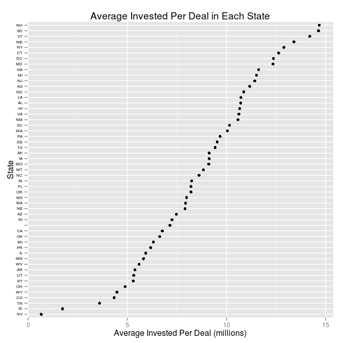

# Analysis of the New Markets Tax Credit Program
Rashan Jibowu  
03/20/2015  

Load necessary libraries


```r
library(data.table)
library(ggplot2)
library(scales)
```

Load the data


```r
data <- read.csv("./data/projects.csv", na.strings = NA)
```

Clean up column names


```r
colnames(data) <- c("projectID", "metroStatus", "year", "CDE", "investment", "projectCost", "city", "state", "zipcode", "purpose", "investeeType", "multiCDEStatus", "multiTractStatus")
```

Clean up California data


```r
data[data$state == "Ca",]["state"] <- c("CA")
```

Convert to data table for faster processing


```r
dt <- data.table(data)
```

Add columns for analysis


```r
# portion financed
dt <- dt[, portionFinanced:=investment/projectCost]

# consolidate purpose categories
dt <- dt[, purposeCategory:=purpose]

indicies <- grep("Business Financing|Microenterprise", dt$purpose)
dt[indicies, "purposeCategory"] <- c("Business")

indicies <- grep("Multi Family", dt$purpose)
dt[indicies, "purposeCategory"] <- c("Real Estate -- Multi-Family")

indicies <- grep("Single Family", dt$purpose)
dt[indicies, "purposeCategory"] <- c("Real Estate -- Single-Family")

indicies <- grep("Commercial", dt$purpose)
dt[indicies, "purposeCategory"] <- c("Real Estate -- Commercial")

indicies <- grep("Other", dt$purpose)
dt[indicies, "purposeCategory"] <- c("Other")

# convert to a factor
dt$purposeCategory <- as.factor(dt$purposeCategory)
```

Find and plot the ten most active CDFIs overall


```r
totalInvestedByCDE <- suppressWarnings(dt[,list(totalInvestment = sum(investment)), by = c("CDE")])

# Exclude the Multi-CDE Projects
topInvestors <- totalInvestedByCDE[order(totalInvestment, decreasing = TRUE),][2:11]

# prepare plot parameters
title <- c("10 Most Active CDEs")
yLabel <- c("Total Investment (millions)")
xLabel <- c("Community Development Entity (CDE)")

# Plot data
g <- ggplot(topInvestors, aes(y = totalInvestment / 1e+06, x = reorder(CDE, totalInvestment)))
g + geom_bar(stat = "identity", color = "white", fill = "#003366", width = 0.8) + 
  coord_flip() + 
  labs(title = title, x = xLabel, y = yLabel)
```

 

Find and plot the most active CDFIs in NY


```r
# Filter for projects in NY only and exclude multi-CDE projects
nyInvestors <- dt[(state == "NY" & CDE != "Multi-CDE Project"), list(totalInvestment = sum(investment)), by = c("CDE")]

topNYInvestors <- nyInvestors[order(totalInvestment, decreasing = TRUE), ][1:10,]

# prepare plot parameters
title <- c("10 Most Active CDEs in NY")
yLabel <- c("Total Investment (millions)")
xLabel <- c("Community Development Entity (CDE)")

# plot data
g <- ggplot(topNYInvestors, aes(y = totalInvestment / 1e+06, x = reorder(CDE, totalInvestment)))
g + geom_bar(stat = "identity", color = "white", fill = "#003366", width = 0.8) + 
  coord_flip() + 
  labs(title = title, x = xLabel, y = yLabel)
```

 

Find and plot average capital deployed per state


```r
title <- c("Average Invested Per Deal in Each State")
yLabel <- c("Average Invested Per Deal (millions)")
xLabel <- c("State")

avgPerState <- dt[,list(avgInvested = mean(investment, na.rm = TRUE)), by = c("state")]

g <- ggplot(avgPerState, aes(x = avgInvested / 1e+06, y = reorder(state, avgInvested)))
g + geom_point() + labs(title = title, y = xLabel, x = yLabel) +
  theme(axis.text.y = element_text(size = 6, color = "#000000"))
```

 

Find average portion of projects financed with NMTC dollars


```r
title <- c("Average Portion Financed By State")
yLabel <- c("Average Portion Financed with NMTC Funding")
xLabel <- c("State")

# average portion funded by state
avgPortionByState <- dt[CDE != "Multi-CDE Project", list(avgPortionFinanced = mean(portionFinanced, na.rm = TRUE)), by = c("state")]

g <- ggplot(avgPortionByState, aes(x = avgPortionFinanced, y = reorder(state, avgPortionFinanced)))
g + geom_point() +
  scale_x_continuous(labels = percent_format()) +
  labs(title = title, y = xLabel, x = yLabel) +
  theme(axis.text.y = element_text(size = 6, color = "#000000"))
```

 

Find average portion financed over time


```r
# average funded over time
avgPortionByYear <- dt[CDE != "Multi-CDE Project", list(avgPortionFinanced = mean(portionFinanced, na.rm = TRUE)), by = c("year")]

 g <- ggplot(avgPortionByYear, aes(x = year, y = avgPortionFinanced))
 g + geom_line()
```

 

`tion of projects funded by purpose


```r
dt[,list(avgPortion = mean(portionFinanced, na.rm = TRUE)), by = c("purposeCategory")]
```

```
##                 purposeCategory avgPortion
## 1:                     Business  0.7422870
## 2:    Real Estate -- Commercial  0.6909290
## 3: Real Estate -- Single-Family  0.6395683
## 4:                        Other  0.8923109
## 5:  Real Estate -- Multi-Family  0.6534208
```
