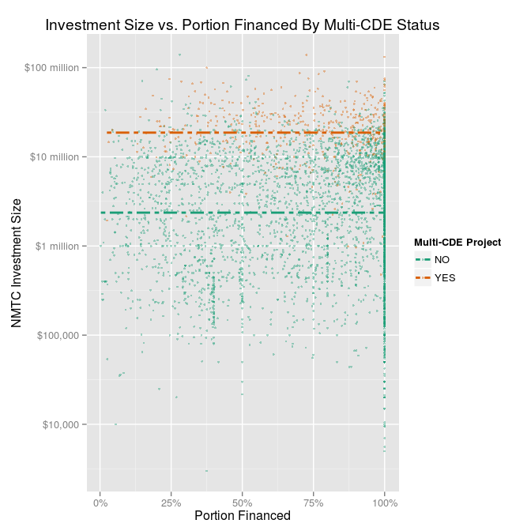
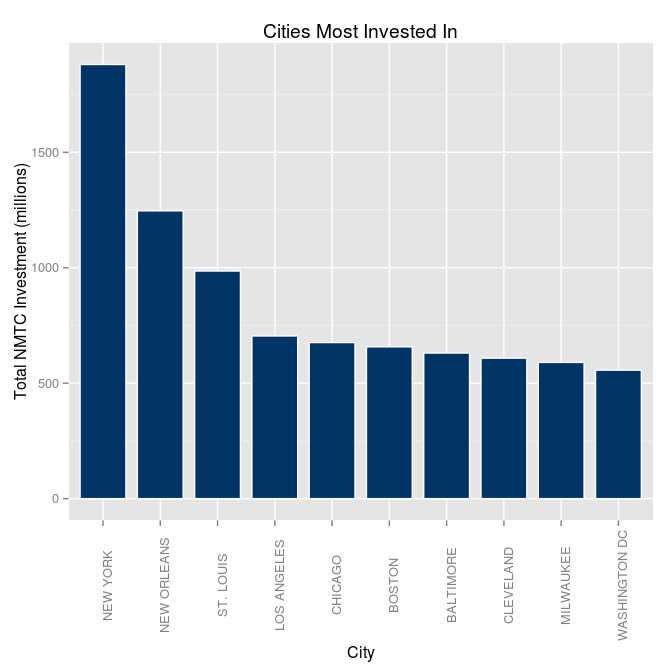

# Analysis of the New Markets Tax Credit Program
Rashan Jibowu  
03/20/2015  

Load necessary libraries


```r
library(data.table)
library(ggplot2)
library(scales)
library(grid)
```

Load the data


```r
data <- read.csv("./data/projects.csv", na.strings = NA)
```

Clean up column names


```r
colnames(data) <- c("projectID", "metroStatus", "year", "CDE", "investment", "projectCost", "city", "state", "zipcode", "purpose", "investeeType", "multiCDEStatus", "multiTractStatus")
```

Clean up California data


```r
data[data$state == "Ca",]["state"] <- c("CA")
```

Clean up city names


```r
data$city <- tolower(data$city)

indices <- grep("chicago,", data$city)
data[indices, c("city")] <- c("chicago")

indices <- grep("cleveland|clveland,", data$city)
data[indices, c("city")] <- c("cleveland")

indices <- grep("couer dalene", data$city)
data[indices, c("city")] <- c("couer d'alene")

indices <- grep("detroit,|detriot", data$city)
data[indices, c("city")] <- c("detroit")

indices <- grep("ft.*myers", data$city)
data[indices, c("city")] <- c("fort myers")

indices <- grep("ft. worth", data$city)
data[indices, c("city")] <- c("fort worth")

indices <- grep("ft. lauderdale", data$city)
data[indices, c("city")] <- c("fort lauderdale")

indices <- grep("ft.*wayne", data$city)
data[indices, c("city")] <- c("fort wayne")

indices <- grep("gainsville", data$city)
data[indices, c("city")] <- c("gainesville")

indices <- grep("grand rapids", data$city)
data[indices, c("city")] <- c("grand rapids")

indices <- grep("hamtramck", data$city)
data[indices, c("city")] <- c("hamtrack")

indices <- grep("jacksonville", data$city)
data[indices, c("city")] <- c("jacksonville")

indices <- grep("lacross", data$city)
data[indices, c("city")] <- c("la crosse")

indices <- grep("lynwood", data$city)
data[indices, c("city")] <- c("lynnwood")

indices <- grep("mid west city", data$city)
data[indices, c("city")] <- c("midwest city")

indices <- grep("mt.*vernon", data$city)
data[indices, c("city")] <- c("mount vernon")

indices <- grep("opa-locka", data$city)
data[indices, c("city")] <- c("opa locka")

indices <- grep("philadephia", data$city)
data[indices, c("city")] <- c("philadelphia")

indices <- grep("pittsburg", data$city)
data[indices, c("city")] <- c("pittsburgh")

indices <- grep("poughkeepsie", data$city)
data[indices, c("city")] <- c("poughkeepsie")

indices <- grep("san bernardino", data$city)
data[indices, c("city")] <- c("san bernadino")

indices <- grep("san fracisco", data$city)
data[indices, c("city")] <- c("san francisco")

indices <- grep("sprinfield", data$city)
data[indices, c("city")] <- c("springfield")

indices <- grep("st.*louis", data$city)
data[indices, c("city")] <- c("st. louis")

indices <- grep("st.*paul|saint paul", data$city)
data[indices, c("city")] <- c("st. paul")

indices <- grep("st.*peter(s)?burg", data$city)
data[indices, c("city")] <- c("st. petersburg")

indices <- grep("washington", data$city)
data[indices, c("city")] <- c("washington dc")

indices <- grep("wilmington", data$city)
data[indices, c("city")] <- c("wilmington")

# merge boroughs of NY

indices <- grep("^(bronx|brooklyn)$", data$city)
data[indices, c("city")] <- c("new york")

data[(data$city == "manhattan" & data$state == "NY"), c("city")] <- c("new york")

# merge factors
data$city <- as.factor(data$city)
```

Convert to data table for faster processing


```r
dt <- data.table(data)
```

Add columns for analysis


```r
# portion financed
dt <- dt[, portionFinanced:=investment/projectCost]

# consolidate purpose categories
dt <- dt[, purposeCategory:=purpose]

indicies <- grep("Business Financing|Microenterprise", dt$purpose)
dt[indicies, "purposeCategory"] <- c("Business")

indicies <- grep("Multi Family", dt$purpose)
dt[indicies, "purposeCategory"] <- c("Multi-family")

indicies <- grep("Single Family", dt$purpose)
dt[indicies, "purposeCategory"] <- c("Single-family")

indicies <- grep("Commercial", dt$purpose)
dt[indicies, "purposeCategory"] <- c("Com. RE")

indicies <- grep("Other", dt$purpose)
dt[indicies, "purposeCategory"] <- c("Other")

# convert to a factor
dt$purposeCategory <- as.factor(dt$purposeCategory)
```

Find and plot the ten most active CDFIs overall


```r
totalInvestedByCDE <- suppressWarnings(dt[, 
                                          list(totalInvestment = sum(investment)), 
                                          by = c("CDE")])

# Exclude the Multi-CDE Projects
topInvestors <- totalInvestedByCDE[order(totalInvestment, decreasing = TRUE),][2:11]

# prepare plot parameters
title <- c("10 Most Active CDEs")
yLabel <- c("Total Investment (millions)")
xLabel <- c("Community Development Entity (CDE)")

# Plot data
g <- ggplot(topInvestors, 
            aes(y = totalInvestment / 1e+06, x = reorder(CDE, totalInvestment)))

g + geom_bar(stat = "identity", color = "white", fill = "#003366", width = 0.8) + 
  coord_flip() + 
  labs(title = title, x = xLabel, y = yLabel)
```

 

Find and plot the most active CDFIs in NY


```r
# Filter for projects in NY only and exclude multi-CDE projects
nyInvestors <- dt[(state == "NY" & CDE != "Multi-CDE Project"), 
                  list(totalInvestment = sum(investment, na.rm = TRUE)), 
                  by = c("CDE")]

topNYInvestors <- nyInvestors[order(totalInvestment, decreasing = TRUE), ][1:10,]

# prepare plot parameters
title <- c("10 Most Active CDEs in NY")
yLabel <- c("Total Investment (millions)")
xLabel <- c("Community Development Entity (CDE)")

# plot data
g <- ggplot(topNYInvestors, 
            aes(y = totalInvestment / 1e+06, x = reorder(CDE, totalInvestment)))

g + geom_bar(stat = "identity", color = "white", fill = "#003366", width = 0.8) + 
  coord_flip() + 
  labs(title = title, x = xLabel, y = yLabel)
```

 

Find and plot average capital deployed per state


```r
title <- c("Average Invested Per Deal in Each State")
xLabel <- c("Average Invested Per Deal (millions)")
yLabel <- c("State")

avgPerState <- dt[, 
                  list(avgInvested = mean(investment, na.rm = TRUE)), 
                  by = c("state")]

g <- ggplot(avgPerState, 
            aes(x = avgInvested / 1e+06, y = reorder(state, avgInvested)))

g + geom_point() + 
  labs(title = title, y = yLabel, x = xLabel) +
  theme(axis.text.y = element_text(size = 6, color = "#000000"))
```

 

Find average portion of projects financed with NMTC dollars


```r
title <- c("Average Portion Financed By State")
xLabel <- c("Average Portion Financed with NMTC Funding")
yLabel <- c("State")

# average portion funded by state
avgPortionByState <- dt[CDE != "Multi-CDE Project", 
                        list(avgPortionFinanced = mean(portionFinanced, na.rm = TRUE)), 
                        by = c("state")]

g <- ggplot(avgPortionByState, aes(x = avgPortionFinanced, y = reorder(state, avgPortionFinanced)))

g + geom_point() +
  scale_x_continuous(labels = percent_format()) +
  labs(title = title, y = yLabel, x = xLabel) +
  theme(axis.text.y = element_text(size = 6, color = "#000000"))
```

 

Plot the average portion financed over time by purpose


```r
# Prepare plot parameters
title <- c("Average Portion Financed By Year and Purpose")
yLabel <- c("Average Portion Financed with NMTC Funding")
xLabel <- c("Year")

# average funded over time
avgPortionByYear <- dt[CDE != "Multi-CDE Project", 
                       list(avgPortionFinanced = mean(portionFinanced, na.rm = TRUE)),
                       by = c("year", "purposeCategory")]

# Make the plot
g <- ggplot(avgPortionByYear, aes(x = year, y = avgPortionFinanced))
g + geom_line() +
  facet_grid(purposeCategory~.) +
  scale_y_continuous(labels = percent_format()) +
  scale_x_continuous(breaks = unique(avgPortionByYear$year)) +
  labs(title = title, x = xLabel, y = yLabel) +
  theme(axis.text.y = element_text(size = 8, color = "#000000"),
        strip.text.y = element_text(size = 6.5),
        panel.margin = unit(0.5, "lines"))
```

 

Plot deal size against portion financed


```r
# Prepare plot parameters
title <- c("Investment Size vs. Portion Financed By Multi-CDE Status")
yLabel <- c("NMTC Investment Size")
xLabel <- c("Portion Financed")

# special labels for log transformation of y axis
yAxisLabels <- c("$1,000", "$10,000", "$100,000", "$1 million", "$10 million", "$100 million", "$1 billion")

# make plot
g <- ggplot(dt, 
            aes(x = portionFinanced, y = investment, color = multiCDEStatus))

g + geom_point(alpha = 0.4, size = 1) +   
  scale_color_brewer(type = "qual", palette = 2, name = "Multi-CDE Project") +
  geom_line(stat = "hline", yintercept = "mean", linetype="twodash", size = 1) +   
  labs(title = title, x = xLabel, y = yLabel) +
  scale_x_continuous(labels = percent_format()) +
  scale_y_log10(breaks = trans_breaks("log10", function(x) 10^x),
                labels = yAxisLabels)
```

 

Cities with the greatest investment


```r
# form the data
investmentByCity <- dt[,
                       list(totalInvestment = sum(investment, na.rm = TRUE)), 
                       by = c("city", "state")]

topCities <- investmentByCity[order(totalInvestment, decreasing = TRUE),][1:10,]

# Prepare plot parameters
title <- c("Cities Most Invested In")
yLabel <- c("Total NMTC Investment (millions)")
xLabel <- c("City")

# make plot
g <- ggplot(topCities, aes(x = reorder(city, -totalInvestment), 
                           y = totalInvestment / 1e+06))

g + geom_bar(stat = "identity", color = "white", fill = "#003366", width = 0.8) +
  theme(axis.text.x = element_text(angle = 90)) +
  labs(title = title, x = xLabel, y = yLabel) +
  scale_x_discrete(labels = toupper(topCities$city))
```

 

Most aggressive CDEs


```r
# form the data
avgPortionTotalByCDE <- dt[CDE != "Multi-CDE Project", 
                           list(avgPortion = mean(portionFinanced, na.rm = TRUE), 
                                totalInvested = sum(investment, na.rm = TRUE)), 
                           by = c("CDE")]

# filter out minor CDEs - 50 million minimum in total investment
# include CDEs with at least an 80% of project funding coming from NMTC
majorAggressiveCDEs <- avgPortionTotalByCDE[(totalInvested >= 5 * 1e+07 & avgPortion >= 0.8),]

# Prepare plot parameters
title <- c("Most Aggressive Major CDEs")
xLabel <- c("Average Portion of Project Funding via NMTC")
yLabel <- c("CDE")

g <- ggplot(majorAggressiveCDEs, 
            aes(x = avgPortion, y = reorder(CDE, avgPortion)))

g + geom_point(size = 1.5) +
  scale_x_continuous(labels = percent_format()) +
  labs(title = title, x = xLabel, y = yLabel) +
  theme(axis.text.y = element_text(size = 7, color = "#000000"))
```

 
